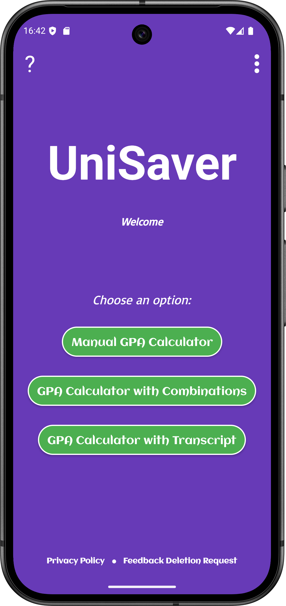
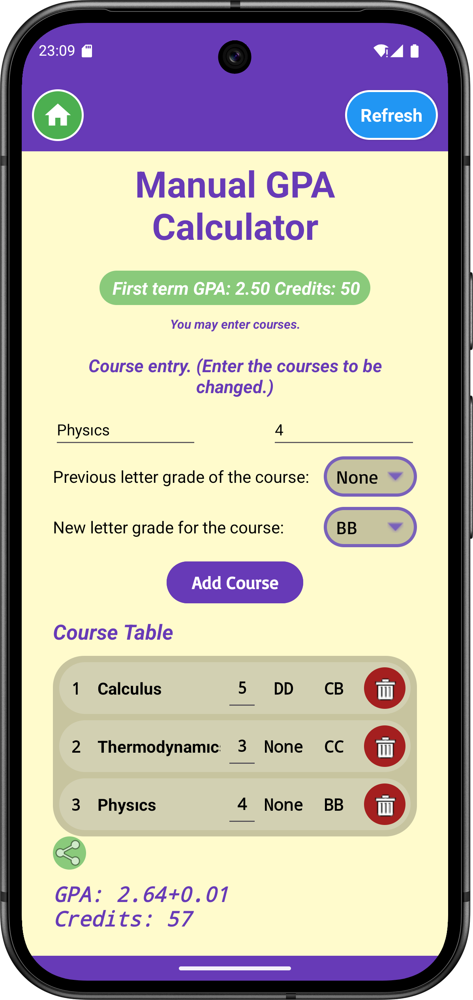
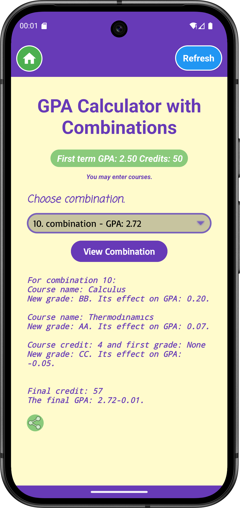
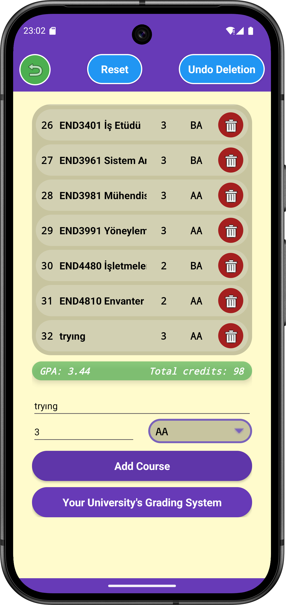
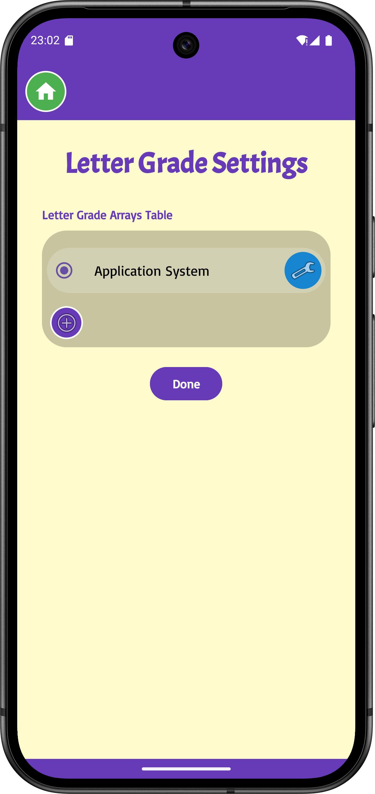
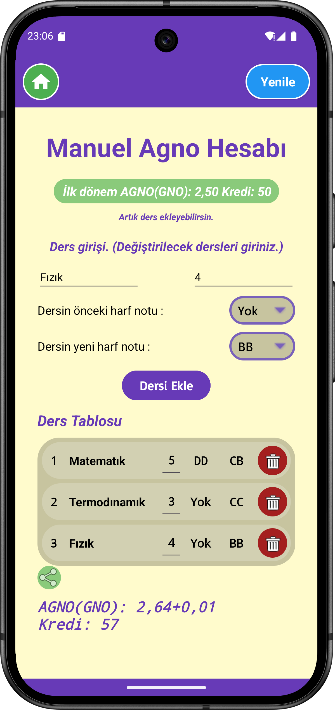
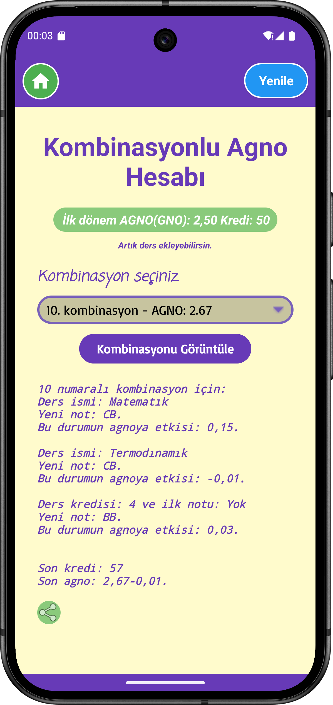

<p align="center"> <a href="#-türkçe">🇹🇷 Türkçe</a> | <a href="#-english">🇬🇧 English</a> </p>

## 🇬🇧 English

<h1 align="center">🎓 Unisaver</h1>

<p align="center">
  <b>Smart GPA Calculator & Transcript Assistant</b>  
  <br>A simple, intelligent, and practical solution for university students.
</p>

---

## 🚀 Features

✨ **Smart GPA Calculation**  
Enter your credits and grades — your GPA is calculated instantly.
Flexible modes for both manual and combination-based calculations.

🧾 **PDF Transcript Reader**  
Easily import your official E-Devlet transcript PDF and calculate your GPA automatically.
Simpler and more intuitive than typical university transcript tools.

💾 **Offline Database (Room)**  
All data stays securely on your device — no server, no worries.
You’re fully in control of your information.

💰 **Google AdMob Integration**  
Banner and interstitial ads enable passive income.
Ad management respects user privacy and data security.

💬 **Feedback System**  
Send feedback directly from within the app — let’s improve it together.

🎨 **Modern & Lightweight UI**  
Built with Material Design principles for a clean, responsive, and user-friendly interface.

---

## 🧠 Tech Stack

| Layer | Technology |
|--------|------------|
| 💻 Language | Java |
| 🧩 Database | Room Database |
| ☁️ Services | Firebase Cloud Messaging, Google AdMob |
| 📄 PDF Support | Android PDF API |
| 🎨 UI | XML + Custom Components |
| ⚙️ Build | Gradle |

---

## 📱 Screenshots

<p align="center">
  
  
  
  
  
</p>

---

## 🔧 Setup

1. Clone the repository:
   ```bash
   git clone https://github.com/<your-username>/Unisaver.git

## 🇹🇷 Türkçe

<h1 align="center">🎓 Unisaver</h1>

<p align="center">
  <b>Akıllı GPA Hesaplayıcı & Transkript Asistanı</b>  
  <br>Üniversite öğrencileri için sade, akıllı ve işlevsel bir çözüm.
</p>

---

## 🚀 Özellikler

✨ **Akıllı Ortalama Hesaplama**  
Kredi ve not bilgilerini gir, ortalaman otomatik hesaplansın.  
Hem manuel hem kombinasyonlu hesaplama modlarıyla esneklik senin elinde.

🧾 **PDF Transkript Okuyucu**  
Güncel E-Devlet transkript pdfini kullanarak daha serbest şekilde hesaplama yapabilirsin.  
Cazip ve basit bir ekran ile üniversitelerin kendi transkript senaryo hesaplamalarından daha basit.

💾 **Offline Veritabanı (Room)**  
Tüm notlar cihazında, tamamen sana özel.  
Sunucuya gerek yok, veriler senin kontrolünde.

💰 **Google AdMob Entegrasyonu**  
Banner ve geçiş reklamlarıyla pasif gelir akışı sağlar.  
Veri güvenliğini koruyarak reklam yönetimi yapılır.

💬 **Geri Bildirim Sistemi**  
Uygulama içinden kolayca görüş bildir — kullanıcı deneyimini birlikte büyütelim.

🎨 **Modern ve Hafif Arayüz**  
Material Design prensipleriyle tasarlanmış sade, responsive ve kullanıcı dostu UI.

---

## 🧠 Kullanılan Teknolojiler

| Katman | Teknoloji |
|--------|------------|
| 💻 Dil | Java |
| 🧩 Veritabanı | Room Database |
| ☁️ Servisler | Firebase Cloud Messaging, Google AdMob |
| 📄 PDF Desteği | Android PDF API |
| 🎨 UI | XML + Custom Components |
| ⚙️ Build | Gradle |

---

## 📱 Ekran Görüntüleri

<p align="center">
  
  
  
  
  
</p>

---

## 🔧 Kurulum

1. Repoyu klonla:
   ```bash
   git clone https://github.com/<senin-kullanici-adin>/Unisaver.git
